# Configurateur Albert

**Installer en quelques minutes un assistant d'IA qui travaille sur vos fichiers, branché sur
Albert API, l'IA souveraine de l'État, sans connaissance technique.**

L'application installe et règle **OpenCode** et/ou **Pi**, deux assistants qui lisent, écrivent
et transforment les fichiers d'un dossier de votre ordinateur. Elle ajoute aussi des **skills**
(savoir-faire, comme anonymiser un texte ou transcrire un enregistrement) et des **connecteurs**
(accès aux données publiques de data.gouv.fr…).

Public visé : enseignant·es et agents publics, sans compétence technique (formation DRANE Sarthe).

> Durée : **10 à 15 minutes**, dont la moitié d'attente pendant les téléchargements.
> Aucun droit administrateur n'est nécessaire.

---

## Sommaire

1. [Avant de commencer](#1-avant-de-commencer)
2. [Créer votre clé Albert](#2-créer-votre-clé-albert)
3. [Ouvrir un terminal](#3-ouvrir-un-terminal)
4. [Lancer l'installateur](#4-lancer-linstallateur)
5. [Suivre l'assistant, écran par écran](#5-suivre-lassistant-écran-par-écran)
6. [Utiliser OpenCode et Pi](#6-utiliser-opencode-et-pi)
7. [Relancer, mettre à jour, désinstaller](#7-relancer-mettre-à-jour-désinstaller)
8. [En cas de problème](#8-en-cas-de-problème)
9. [Méthode de secours : l'exécutable à télécharger](#9-méthode-de-secours--lexécutable-à-télécharger)
10. [Sécurité, confidentialité, ce qui est modifié](#10-sécurité-confidentialité-ce-qui-est-modifié)
11. [Questions fréquentes](#11-questions-fréquentes)
12. [Pour les développeurs](#pour-les-développeurs)

---

## 1. Avant de commencer

Il vous faut :

- **une adresse électronique professionnelle** d'agent de l'État (ou d'un organisme sous tutelle) :
  elle sert à vous connecter au Playground Albert via **ProConnect** ;
- **une connexion Internet** (le réseau de l'établissement convient en général ; voir
  [En cas de problème](#8-en-cas-de-problème) si un pare-feu bloque) ;
- **un ordinateur** sous macOS (puce Apple M1, M2… ou Intel), Windows 10/11 ou Linux.

Vous n'avez **rien à installer à l'avance** : ni Python, ni Node.js, ni OpenCode, ni Pi.
L'installateur s'en charge.

> **Règle d'or** : n'utilisez jamais de données nominatives d'élèves (noms, notes,
> appréciations…) avec l'IA, même sur une plateforme de l'État. Le skill
> « Anonymiser un texte » est là pour vous aider.

---

## 2. Créer votre clé Albert

La clé est un mot de passe qui permet à OpenCode et Pi d'utiliser Albert en votre nom.

1. Ouvrez la page des clés : **https://albert.playground.etalab.gouv.fr/keys**
   (l'installateur propose aussi un bouton qui l'ouvre pour vous).
2. Connectez-vous avec **ProConnect** et votre adresse professionnelle.
3. Créez une nouvelle clé (donnez-lui un nom, par exemple « OpenCode portable »).
4. **Copiez-la immédiatement** : elle commence par `sk-eyJ…` et **ne sera plus jamais affichée**.
   Si vous la perdez, il suffit d'en créer une nouvelle.

> 🔒 Ne collez jamais votre clé dans une conversation avec une IA, un courriel, un document
> partagé ou une capture d'écran. Si cela arrive : supprimez-la dans le Playground et
> créez-en une autre.

---

## 3. Ouvrir un terminal

Le terminal est une fenêtre où l'on tape des commandes. Vous n'y collerez **qu'une seule ligne**.

| Système | Comment ouvrir le terminal |
|---|---|
| **macOS** | `Cmd ⌘` + `Espace`, tapez **Terminal**, puis Entrée. (Ou : Launchpad → Autres → Terminal.) |
| **Windows 11** | Clic droit sur le bouton **Démarrer** → **Terminal**. |
| **Windows 10** | Clic droit sur le bouton **Démarrer** → **Windows PowerShell**. |
| **Linux** | `Ctrl` + `Alt` + `T`, ou cherchez « Terminal » dans les applications. |

---

## 4. Lancer l'installateur

Copiez la ligne correspondant à votre système, collez-la dans le terminal, puis appuyez sur **Entrée**.

**macOS et Linux :**

```bash
curl -LsSf https://raw.githubusercontent.com/mrouxprofdemaths/configurateur-albert/v0.1.0/install.sh | sh
```

**Windows :**

```powershell
irm https://raw.githubusercontent.com/mrouxprofdemaths/configurateur-albert/v0.1.0/install.ps1 | iex
```

> Pour coller dans le terminal : `Cmd ⌘ + V` (macOS), `Ctrl + V` ou clic droit (Windows),
> `Ctrl + Maj + V` (Linux).

Le terminal affiche alors :

```text
=== Configurateur Albert (v0.1.0) ===

Préparation (une seule fois) : téléchargement de l'outil uv…
La fenêtre de l'installateur va s'ouvrir (premier lancement : 1 à 2 minutes).
Laissez ce terminal ouvert pendant toute l'installation.
```

Patientez : **au premier lancement, la fenêtre met 1 à 2 minutes à apparaître** (téléchargement
d'un petit outil, *uv*, et d'une version privée de Python, rangés dans votre dossier personnel).
Les lancements suivants sont quasi immédiats.

> ⚠️ **Ne fermez pas le terminal** tant que l'installation n'est pas terminée : fermer le
> terminal ferme aussi l'installateur.

Pourquoi passer par le terminal plutôt que par un programme à double-cliquer ? Parce qu'un
programme téléchargé et non signé par Apple ou Microsoft est bloqué par **Gatekeeper** (macOS)
ou **SmartScreen** / l'antivirus (Windows). La commande ci-dessus évite ces blocages.

---

## 5. Suivre l'assistant, écran par écran

> Les captures ci-dessous ont été réalisées sur Linux avec des données fictives ;
> sur votre ordinateur, les polices et les boutons ont l'apparence de votre système.

### Écran 1 — Bienvenue

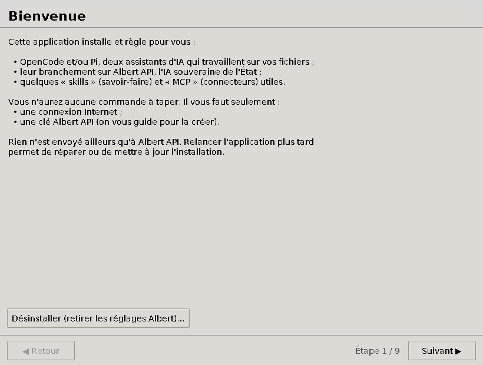

Présentation de ce qui va être fait. Cliquez sur **Suivant**.
Le bouton **Désinstaller** (en bas) sert plus tard à tout retirer.

### Écran 2 — Diagnostic

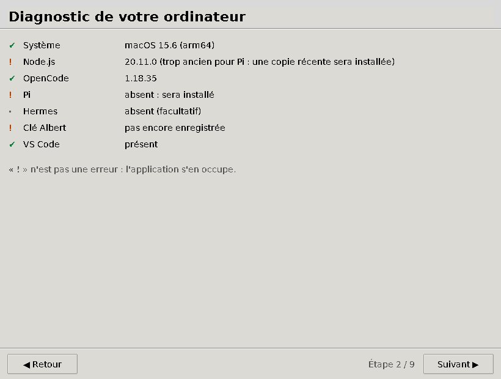

L'application examine votre ordinateur : système, Node.js (moteur dont OpenCode et Pi ont
besoin), OpenCode et Pi déjà présents ou non, clé déjà enregistrée…

- **Aucune ligne n'est une erreur** : un « **!** » orange signale seulement quelque chose
  que l'application va installer ou régler pour vous.
- Sous Windows, une ligne *Git for Windows* apparaît : Pi en a besoin, l'application tente
  de l'installer.

### Écran 3 — Votre clé Albert

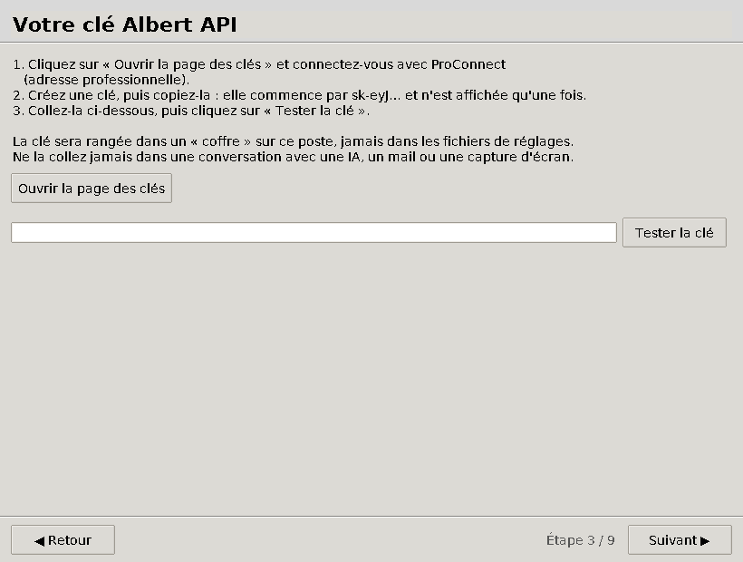

1. Si vous n'avez pas encore de clé, cliquez sur **Ouvrir la page des clés** (voir
   [étape 2](#2-créer-votre-clé-albert)).
2. Collez la clé dans le champ (elle s'affiche sous forme de points •••• : c'est normal).
3. Cliquez sur **Tester la clé**.

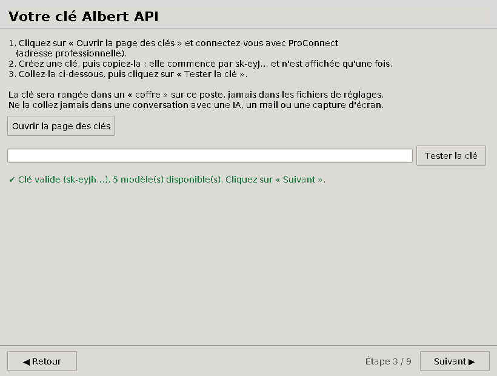

Un message **vert** confirme que la clé fonctionne et indique combien de modèles sont
disponibles. Un message **rouge** explique le problème (clé incomplète, révoquée, pas de
connexion…). Si une clé est déjà enregistrée sur l'ordinateur, l'application propose de la réutiliser.

### Écran 4 — Assistants et modèle

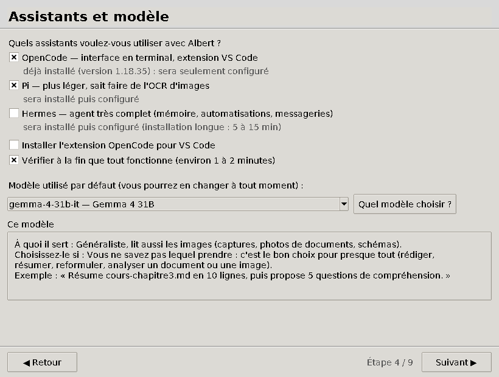

- **OpenCode** : le plus complet, avec une extension pour VS Code. **Pi** : plus léger, sait
  aussi recopier le texte d'une image (OCR). Vous pouvez installer les deux.
- **Modèle par défaut** : la liste est lue en direct chez Albert ; gardez
  **gemma-4-31b-it** (recommandé) si vous hésitez. Les autres modèles restent accessibles
  ensuite depuis l'assistant.

| Modèle | À utiliser pour |
|---|---|
| `gemma-4-31b-it` | usage général, lit aussi les images — **recommandé** |
| `gpt-oss-120b` | raisonnement plus poussé (quota réduit : 10 requêtes/min) |
| `deepseek-v4-flash-0731` | programmation uniquement (modèle extra-européen) |
| `ministral-3-8b-instruct-2512` | petit et rapide (Pi seulement) |
| `lightonocr-2-1b` | recopier le texte d'une image (Pi seulement) |

- **Extension VS Code** : à cocher si vous utilisez VS Code (la case est grisée sinon).
- **Vérifier à la fin** : laissez coché ; l'application fera lire un fichier test à chaque assistant.

### Écran 5 — Skills (savoir-faire)

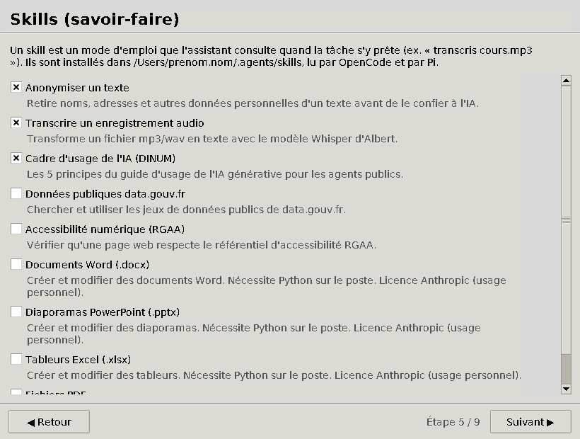

Un skill est un mode d'emploi que l'assistant consulte quand la tâche s'y prête. Les trois
premiers sont cochés par défaut :

| Skill | Ce qu'il apporte | Exemple de demande |
|---|---|---|
| Anonymiser un texte | retire noms, adresses, numéros… avant tout traitement | « Anonymise compte-rendu.md » |
| Transcrire un enregistrement audio | mp3/wav → texte ou sous-titres (Whisper d'Albert) | « Transcris cours.mp3 » |
| Cadre d'usage de l'IA (DINUM) | les 5 principes du guide d'usage de l'IA pour les agents publics | « Puis-je utiliser l'IA pour ce travail ? » |
| Données publiques data.gouv.fr | chercher et exploiter des jeux de données publics | « Trouve les effectifs des lycées de la Sarthe » |
| Accessibilité (RGAA) | vérifier l'accessibilité d'une page web | « Vérifie l'accessibilité de index.html » |
| Word, PowerPoint, Excel, PDF | créer et modifier ces fichiers (nécessite Python) | « Fais un diaporama à partir de notes.md » |

Faites défiler la liste (molette de la souris) pour tout voir.

### Écran 6 — Connecteurs (MCP)

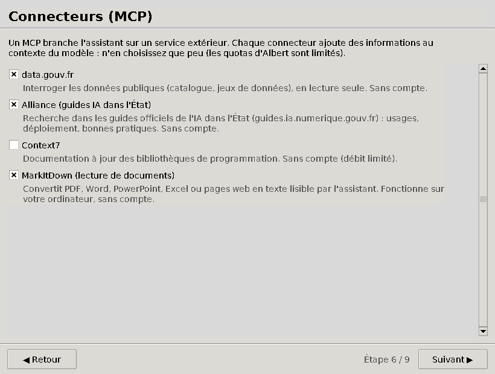

Un connecteur donne à l'assistant un accès direct à un service extérieur.
**Choisissez-en peu** : chaque connecteur occupe une partie de la mémoire de travail du
modèle et consomme du quota Albert.

- **data.gouv.fr** (coché par défaut) : interroger les données publiques, en lecture seule, sans compte.
- **Context7** : documentation à jour des bibliothèques de programmation (utile surtout pour coder).

### Écran 7 — Récapitulatif

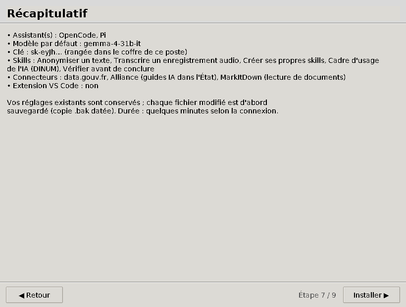

Vérifiez vos choix ; **Retour** permet encore de les modifier. Cliquez sur **Installer**.

### Écran 8 — Installation

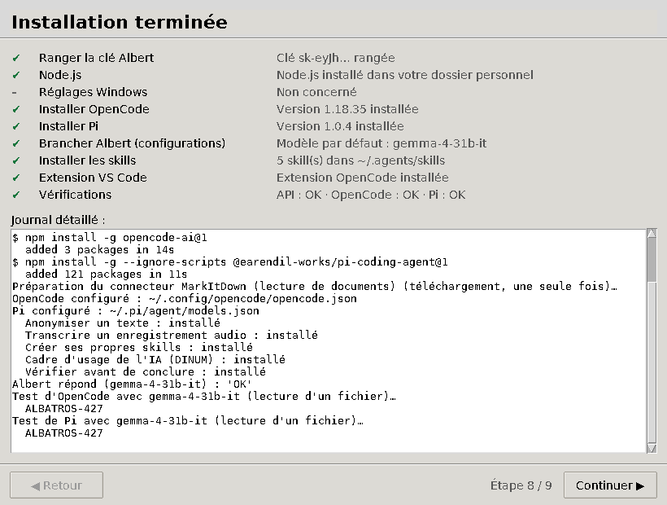

Chaque étape s'affiche avec son état :

| Symbole | Signification |
|---|---|
| ✔ (vert) | étape réussie |
| … (bleu) | en cours |
| – (gris) | non concernée ou non demandée |
| ! (orange) | réussie en partie, à vérifier (le détail est indiqué à droite) |
| ✖ (rouge) | échec (voir [En cas de problème](#8-en-cas-de-problème)) |

Le **journal détaillé** montre tout ce qui se passe (la clé n'y apparaît jamais en entier).
La dernière étape fait lire un fichier test par chaque assistant : si elle est verte,
tout fonctionne de bout en bout.

### Écran 9 — C'est prêt

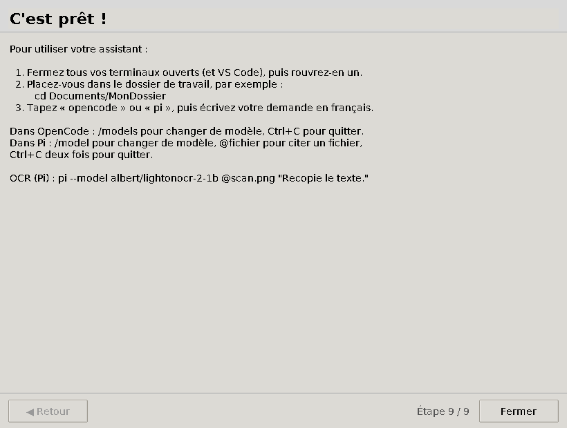

Le mode d'emploi s'affiche. Si une étape a échoué, l'écran ajoute une fiche de dépannage.
Cliquez sur **Fermer** : le terminal se libère, vous pouvez le fermer.

---

## 6. Utiliser OpenCode et Pi

> **Important** : **fermez tous les terminaux** (et VS Code) puis **rouvrez-en un**.
> Les terminaux ouverts avant l'installation ne connaissent pas encore votre clé.

Placez-vous dans le dossier où se trouvent vos fichiers, puis lancez l'assistant :

```bash
cd Documents/MonDossier
opencode        # ou : pi
```

Écrivez ensuite votre demande en français, par exemple :

- « Résume le fichier cours-chapitre3.md en 10 lignes. »
- « Crée une fiche d'exercices sur les fonctions affines à partir de cours.md. »
- « Anonymise compte-rendu-conseil.md. »
- « Transcris reunion.mp3. »

| Action | OpenCode | Pi |
|---|---|---|
| Changer de modèle | `/models` | `/model` (puis `Ctrl+S` pour en faire le défaut) |
| Citer un fichier | `@nom-du-fichier` | `@nom-du-fichier` |
| Requête ponctuelle sans interface | `opencode run "…"` | `pi -p "…"` |
| Reprendre la dernière session | — | `pi --continue` |
| Quitter | `Ctrl+C` | `Ctrl+C` deux fois |

**OCR avec Pi** (recopier le texte d'une image ; images seulement, pas de PDF) :

```bash
pi --model albert/lightonocr-2-1b @scan.png "Recopie le texte."
```

**OpenCode dans VS Code** : ouvrez un dossier dans VS Code, puis le terminal intégré, et tapez
`opencode`. Raccourcis : ouvrir `Cmd/Ctrl + Échap`, nouvelle session `Cmd/Ctrl + Maj + Échap`.

---

## 7. Relancer, mettre à jour, désinstaller

**Relancer la même commande** qu'à l'[étape 4](#4-lancer-linstallateur) permet de :

- **réparer** une installation (fichiers de réglages abîmés, modèle retiré par Albert…) ;
- **changer de clé** (nouvelle clé, clé expirée) ;
- **ajouter** des skills, des connecteurs, ou le second assistant.

Rien n'est installé en double : l'application reconnaît ce qu'elle a déjà fait.

**Désinstaller** : relancez la commande, puis sur l'écran d'accueil cliquez sur
**Désinstaller (retirer les réglages Albert)…**.

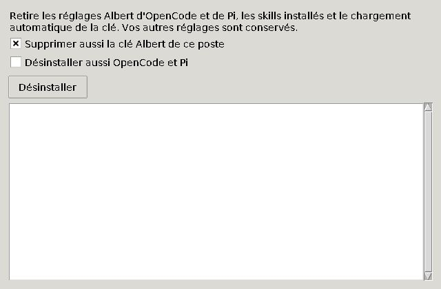

Sont retirés : les réglages Albert d'OpenCode et de Pi, les skills installés par
l'application, le chargement automatique de la clé, la copie personnelle de Node.js et,
si vous le cochez, la clé elle-même et les programmes OpenCode et Pi. **Vos autres réglages
ne sont pas touchés.** Pensez à supprimer aussi la clé dans le Playground si vous ne
l'utilisez plus.

**Mode texte** (sans fenêtre, pour les habitués du terminal) :

```bash
curl -LsSf https://raw.githubusercontent.com/mrouxprofdemaths/configurateur-albert/v0.1.0/install.sh | sh -s -- --texte
```

```powershell
$env:CONFIGURATEUR_TEXTE = "1"; irm https://raw.githubusercontent.com/mrouxprofdemaths/configurateur-albert/v0.1.0/install.ps1 | iex
```

---

## 8. En cas de problème

### Pendant le lancement (dans le terminal)

| Message ou symptôme | Que faire |
|---|---|
| « la version v0.1.0 … est introuvable sur GitHub » | La version n'est pas encore publiée : prévenez la personne qui vous a transmis la commande. En attendant, la commande affichée juste en dessous lance la version en cours de développement. |
| `curl: command not found` (Linux) | Installez curl (`sudo apt install curl`) ou demandez au support. |
| « irm n'est pas reconnu… » (Windows) | Vous êtes dans l'invite de commandes (`cmd`) : ouvrez **PowerShell** ou **Terminal** (voir [étape 3](#3-ouvrir-un-terminal)). |
| Le terminal reste plusieurs minutes sans rien afficher | Premier lancement : téléchargements en cours, patientez jusqu'à 5 minutes sur une connexion lente. |
| « L'installation de uv a échoué » / erreur de connexion | Le réseau ou le pare-feu de l'établissement bloque GitHub : essayez depuis un autre réseau (partage de connexion du téléphone, domicile). |
| L'antivirus signale ou bloque la commande (poste d'établissement) | Le poste est verrouillé par l'administration : contactez votre support informatique avec le lien de cette page. |
| La fenêtre ne s'ouvre pas, mais des questions apparaissent dans le terminal | Pas d'affichage graphique disponible : répondez aux questions dans le terminal (mode texte), le résultat est le même. |

### Pendant l'installation (dans la fenêtre)

| Symptôme | Que faire |
|---|---|
| ✖ sur « Node.js » | Installez Node.js (version **LTS**) depuis https://nodejs.org, puis relancez la commande. |
| ! sur « Réglages Windows » (Git for Windows absent) | Installez Git depuis https://git-scm.com/download/win (options par défaut), puis relancez. |
| ✖ sur « Installer OpenCode » : « une autre version reste prioritaire » | Une version 2 d'OpenCode installée autrement (Homebrew…) masque la version 1 : désinstallez-la puis relancez. |
| ! sur « Vérifications » | Lisez le détail : souvent un quota Albert atteint (429) ou Albert saturé (503). Réessayez plus tard ; le reste de l'installation est en place. |

### Ensuite, en utilisant OpenCode ou Pi

| Symptôme | Cause probable | Solution |
|---|---|---|
| 401 « Invalid API key » | Terminal ouvert avant l'installation, ou clé révoquée | Fermez et rouvrez le terminal ; sinon relancez l'installateur avec une nouvelle clé. |
| `opencode` ou `pi` : « commande introuvable » | Terminal ouvert avant l'installation | Fermez et rouvrez le terminal. |
| « L'exécution de scripts est désactivée » (Windows) | Réglage de sécurité de PowerShell | Relancez l'installateur (il règle ce point) ou contactez le support. |
| 404 « Model not found » | Modèle retiré par Albert | Relancez l'installateur : il relit la liste des modèles disponibles. |
| 429 | Quota par minute atteint | Attendez une minute ou changez de modèle. |
| 503 « Model is too busy » | Albert est saturé | Réessayez plus tard ou changez de modèle. |
| L'assistant répond sans lire vos fichiers | Modèle peu adapté aux outils | Passez à `gemma-4-31b-it` ; relancez l'installateur pour réparer les réglages. |

---

## 9. Méthode de secours : l'exécutable à télécharger

Si vous ne pouvez pas utiliser le terminal, la page
[**Releases**](https://github.com/mrouxprofdemaths/configurateur-albert/releases) propose un
programme à télécharger :

| Système | Fichier |
|---|---|
| Windows 10/11 | `ConfigurateurAlbert-Windows.exe` |
| macOS (puces Apple M1, M2, M3…) | `ConfigurateurAlbert-macOS.zip` (double-cliquer pour décompresser) |
| Linux | `ConfigurateurAlbert-Linux` |

Ces programmes ne sont **pas signés** par Apple ni par Microsoft : votre système affiche un
avertissement au premier lancement, et un poste d'établissement verrouillé peut les refuser.

- **macOS** : double-cliquez sur *ConfigurateurAlbert*. Si macOS refuse de l'ouvrir, allez dans
  **Réglages Système → Confidentialité et sécurité**, descendez jusqu'au message concernant
  ConfigurateurAlbert, cliquez sur **Ouvrir quand même** et confirmez avec votre mot de passe.
- **Windows** : si « Windows a protégé votre ordinateur » s'affiche, cliquez sur
  **Informations complémentaires**, puis **Exécuter quand même**. Si l'antivirus supprime le
  fichier (faux positif fréquent avec ce type de programme), utilisez la méthode du terminal.
- **Linux** : rendez le fichier exécutable (clic droit → Propriétés → Autoriser l'exécution,
  ou `chmod +x ConfigurateurAlbert-Linux`) puis lancez-le.

---

## 10. Sécurité, confidentialité, ce qui est modifié

**La clé** est rangée dans un « coffre » sur votre ordinateur, et nulle part ailleurs :

- macOS / Linux : fichier `~/.albert.env`, lisible par vous seul, chargé à l'ouverture de chaque terminal ;
- Windows : variable d'environnement de votre compte `ALBERT_API_KEY`.

Les réglages d'OpenCode et de Pi ne contiennent **qu'une référence** à cette variable, jamais
la clé elle-même. Elle n'est jamais affichée en entier ni écrite dans le journal.

**Aucune donnée n'est envoyée ailleurs qu'à Albert API** (et aux sites de téléchargement des
logiciels). Pas de télémétrie, pas de compte à créer en dehors du Playground.

**Fichiers modifiés** — une copie datée est faite avant chaque modification
(par exemple `opencode.json.bak-20261007-142501`) :

| Élément | Emplacement |
|---|---|
| Clé Albert (« coffre ») | macOS/Linux : `~/.albert.env`, chargé par `~/.zshrc` / `~/.bashrc` · Windows : variable de compte `ALBERT_API_KEY` |
| Node.js (si absent ou trop ancien) | `~/.local/share/configurateur-albert/node` (Windows : `%LOCALAPPDATA%\configurateur-albert\node`) |
| OpenCode | `~/.config/opencode/opencode.json` (section `albert` seulement) |
| Pi | `~/.pi/agent/models.json`, `settings.json`, `mcp.json` |
| Skills | `~/.agents/skills/` (lu par OpenCode et par Pi) |
| Outil uv et son Python (méthode du terminal) | `~/.local/share/configurateur-albert/uv` et `~/.cache/uv` (Windows : `%LOCALAPPDATA%\configurateur-albert\uv` et `%LOCALAPPDATA%\uv`) ; non retirés par la désinstallation, supprimables à la main |

Vos autres réglages (autres fournisseurs d'IA, autres connecteurs, skills personnels) ne
sont **jamais** modifiés : un skill du même nom que l'un des nôtres, mais créé par vous,
est laissé tel quel.

---

## 11. Questions fréquentes

**Est-ce gratuit ?** Oui : Albert API est fourni par l'État aux agents publics, avec des quotas
(typiquement 50 requêtes/minute et 1 000 requêtes/jour pour un compte d'expérimentation).

**Mes fichiers sont-ils envoyés à Albert ?** Seulement ceux que l'assistant lit pour répondre
à votre demande, et uniquement à Albert (hébergé en France, en cloud qualifié SecNumCloud).

**Puis-je l'installer sur un ordinateur d'établissement ?** Oui si le poste vous laisse ouvrir un
terminal et accéder à GitHub ; aucun droit administrateur n'est requis. Un poste très verrouillé
peut bloquer la commande : il faut alors passer par le support informatique.

**OpenCode ou Pi ?** OpenCode pour commencer (plus guidé, extension VS Code). Pi si vous voulez
l'OCR ou un outil plus léger. Rien n'empêche d'installer les deux.

**Ma clé expire. Que faire ?** Créez-en une nouvelle dans le Playground et relancez la commande
de l'[étape 4](#4-lancer-linstallateur) : choisissez « Utiliser une nouvelle clé ».

**Puis-je utiliser un Mac Intel ?** Oui avec la méthode du terminal. L'exécutable de secours,
lui, n'existe que pour les puces Apple (M1, M2…).

---

## Pour les développeurs

### Lancer depuis les sources

```bash
python3 -m pip install certifi
python3 -m configurateur_albert            # interface graphique
python3 -m configurateur_albert --texte    # mode texte (terminal)
python3 -m configurateur_albert --desinstaller
```

Il faut Python ≥ 3.10 avec Tkinter (fourni par les installeurs de python.org ;
sous Debian/Ubuntu : `sudo apt install python3-tk`).

### Tests

```bash
python3 -m pip install pytest ruff
python3 -m ruff check . && python3 -m pytest -q
```

Les tests utilisent un dossier personnel jetable : ils ne touchent jamais au vrai `$HOME`.

### Captures d'écran du README

Elles sont produites par `docs/captures/generer.py` (interface réelle, données fictives,
sans rien installer). À relancer après toute modification de l'interface ; la commande
exacte (Xvfb + polices DejaVu + Python de uv) est en tête du script.

### Scripts d'amorçage (`install.sh`, `install.ps1`)

Ils installent [uv](https://docs.astral.sh/uv/) dans un dossier privé (`UV_UNMANAGED_INSTALL` :
pas de modification du PATH ni du shell), puis lancent
`uv tool run --python 3.12 --from "configurateur-albert @ <archive de l'étiquette>" configurateur-albert`
avec `UV_PYTHON_PREFERENCE=only-managed` (Python de uv, qui contient Tkinter).

- La version est **figée** dans chaque script (`v0.1.0`) : voir « Publier une nouvelle version ».
- `CONFIGURATEUR_SOURCE=<chemin>` lance une copie locale (utilisé par la CI) ;
  `CONFIGURATEUR_REF=<étiquette ou branche>` choisit une autre version (ex. `main`).
- `install.ps1` est en ASCII pur (compatibilité Windows PowerShell 5.1) et tout son code est dans un
  bloc `& { … }` : sous `irm | iex`, rien ne reste dans la session de l'utilisateur, et il n'appelle
  jamais `exit` (cela fermerait sa fenêtre).

### Publier une nouvelle version

Les commandes du README pointent vers une **étiquette** (`v0.1.0`) : tant qu'elle n'existe pas
sur GitHub, elles renvoient une erreur 404.

1. Choisir le numéro (par exemple `0.2.0`, donc l’étiquette `v0.2.0` ; ci-dessous `vX.Y.Z`) et le reporter **partout** : `__version__` dans
   `configurateur_albert/__init__.py`, `REF` dans `install.sh`, `$Ref` dans `install.ps1`,
   et les URL du README. `python packaging/verifier_version.py` vérifie la cohérence
   (la CI aussi).
2. Fusionner sur `main`.
3. Créer l'étiquette **depuis GitHub** : *Releases → Draft a new release → Choose a tag* :
   `vX.Y.Z` (« Create new tag on publish »), cible `main`, puis **Publish release**.
   La CI construit alors les exécutables et les joint à une release (brouillon) du même nom.
4. Vérifier depuis un autre poste :
   `curl -LsSf https://raw.githubusercontent.com/mrouxprofdemaths/configurateur-albert/vX.Y.Z/install.sh | sh -s -- --version`.

Tant que l'étiquette manque, la CI de `main` affiche un avertissement. Pour tester la
version en cours : `curl -LsSf …/main/install.sh | CONFIGURATEUR_REF=main sh` (Windows :
`$env:CONFIGURATEUR_REF = "main"` avant `irm …/main/install.ps1 | iex`).

### Construire les exécutables

La CI GitHub Actions (`.github/workflows/build.yml`) lance les tests sur les 3 systèmes,
puis construit les exécutables avec PyInstaller. Pousser une étiquette `v0.1.0` crée un
brouillon de *Release* avec les trois fichiers. En local :

```bash
python3 -m pip install pyinstaller certifi
pyinstaller --noconfirm packaging/configurateur-albert.spec
```

### Architecture

```
configurateur_albert/
  catalog.json   modèles testés/exclus, skills et MCP proposés (à éditer sans toucher au code)
  albert.py      test de la clé, GET /v1/models, sélection des modèles
  keystore.py    coffre de la clé + bloc balisé dans ~/.zshrc / ~/.bashrc
  winenv.py      variables de compte Windows (registre HKCU + WM_SETTINGCHANGE)
  node.py        Node.js LTS « utilisateur » (archive nodejs.org vérifiée en SHA-256)
  configs.py     fusion des configurations OpenCode / Pi (et retrait)
  skills.py      installation dans ~/.agents/skills (archives GitHub ou skills embarqués)
  installer.py   enchaînement des étapes, vérifications, désinstallation
  gui.py         assistant Tkinter    cli.py  mode texte
  skills/        skills maison embarqués
```

### Ajouter un skill ou un MCP

- **Skill maison** : créer `configurateur_albert/skills/<nom>/SKILL.md` (frontmatter
  `name` = nom du dossier, `description` précise), puis l'ajouter à `catalog.json`
  avec `"source": {"type": "bundled"}`.
- **Skill d'un dépôt GitHub** : `"source": {"type": "github", "repo": "org/depot", "ref": "main", "path": "skills/nom"}`.
- **MCP** : entrée `{"type": "remote", "url": …}` ou `{"type": "local", "command": ["npx", "-y", "paquet"]}`
  (sous Windows, `npx` est automatiquement lancé via `cmd /c`).

### Choix techniques

- **Python + Tkinter + PyInstaller** : un seul code pour les trois systèmes, dans un langage
  que l'équipe maîtrise ; Tkinter est inclus dans Python, donc aucune dépendance graphique.
- **Pi : MCP natif** (`~/.pi/agent/mcp.json`) depuis Pi 0.99. L'extension `pi-mcp-adapter`
  n'est plus nécessaire (et, si on l'installe, elle désactive le MCP natif).
- **OpenCode épinglé en v1** (`opencode-ai@1`) : c'est le format de configuration testé.
  Si une v2 est détectée, l'application installe la v1 ; si la v2 reste prioritaire
  (installée par Homebrew par exemple), la configuration n'est pas écrite et l'utilisateur est prévenu.
- **Node.js personnel** quand le Node du système est absent, trop ancien (< 22.19 pour Pi)
  ou demande des droits administrateur pour `npm install -g` (postes d'établissement).
- Modèles proposés **lus en direct** sur `GET /v1/models` (catalogue mouvant), enrichis par les
  métadonnées testées de `catalog.json` ; les modèles inconnus sont déclarés « non testés ».
